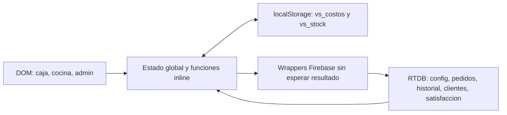

# IQG-000 — Auditoría forense de V11 para IQ GROWTH

**Rol:** Ingeniero de Software Principal  
**Modo:** auditoría de solo lectura  
**Fecha:** 10 de septiembre de 2026  
**Fuente única auditada:** `C:\Users\r2\Desktop\iqholding\legacy\vansam-v11\vansam-pos-v11.html`  
**Integridad de la fuente:** 112.479 bytes, 2.234 líneas, SHA-256 `4bec220566ca90c86ace9b82e3978d12cf7d82cfa83f2d131bbed1cada107aac`

## Alcance, método y límites

Este informe usa exclusivamente la copia oficial de V11 indicada arriba. No se usó como fuente ninguna versión ubicada en Descargas, ni se comparó V11 con otro HTML para producir hallazgos. El único archivo de aplicación que sustenta las conclusiones de este informe es `legacy/vansam-v11/vansam-pos-v11.html`; es también el único archivo dentro de `legacy/vansam-v11` al momento de la auditoría.

Se leyó el archivo completo, se trazaron sus rutas de interfaz, modelos, llamadas de persistencia, estados y cálculos. El bloque JavaScript inline fue compilado sintácticamente en memoria sin ejecutarlo: no se abrió la aplicación, no se cargaron SDKs externos, no se conectó a Firebase, no se instaló ningún paquete y no se leyeron ni cambiaron datos o reglas remotas. No se modificó ningún archivo bajo `legacy/vansam-v11`.

Las referencias `Lx–Ly` corresponden a líneas de la fuente oficial. “Confirmado” significa que el comportamiento se puede deducir directamente del código. “Condicionado” identifica un escenario que depende de reglas, conectividad, datos o concurrencia no observados. No se afirma que haya ocurrido un incidente real, que Firebase esté público ni que una regla remota sea permisiva: esas configuraciones no se entregaron.

## A. Resumen ejecutivo

V11 es un POS monolítico de navegador construido específicamente para un restaurante/pizzería. Tiene trabajo funcional real: catálogo, carrito, tamaños, extras, mitad y mitad, pedidos a cocina, CRM básico, alertas de stock, costos estimados, métricas y exportación. Puede servir como evidencia de procesos y experiencia operativa de VANSAM.

No es una base apta para convertirse directamente en IQ GROWTH. Las decisiones de seguridad, identidad, persistencia, numeración, estados, inventario, caja y auditoría viven en el navegador y no poseen garantías empresariales. El código carece de aislamiento por empresa o sucursal, pagos, caja conciliable, devoluciones, auditoría de eventos, operaciones atómicas, modelo de producción o trazabilidad por lotes.

Los riesgos de mayor impacto son:

1. El acceso de administración se resuelve con una contraseña literal incluida en el HTML y no hay identidad verificable ni roles reales.
2. El flujo activo de envío puede limpiar un pedido, descontar stock y anunciar éxito sin comprobar que el backend aceptó el pedido; en modo local el flujo usado por la interfaz no conserva el pedido.
3. Dos cajas pueden calcular el mismo correlativo y sobrescribirse porque el número local también es la clave remota del pedido.
4. La venta descuenta stock solo en memoria y `localStorage`, mientras los ajustes manuales sí escriben otra fuente remota; las terminales pueden divergir y un saldo viejo puede reaparecer.
5. Caja, delivery, dashboard y reportes presentan importes de pedidos como ventas o totales de caja sin comprobar cobro y los rotulan como diarios aunque recorren todo el historial cargado sin filtrar fecha, pago ni sesión de caja.

La recomendación es conservar V11 intacta como legado y fuente de descubrimiento, extraer conocimiento y datos solo mediante un proceso posterior autorizado, y construir IQ GROWTH alrededor de contratos de dominio independientes de la base de datos elegida. V11 usa Firebase Realtime Database, pero no se recomienda ni se descarta ninguna tecnología final por ese hecho.

## B. Qué tenemos realmente

### Estructura y tecnologías

V11 es un único archivo HTML de 2.234 líneas que contiene markup, CSS, JavaScript, datos maestros y configuración de acceso a la base. No hay módulos, pruebas, servidor propio, manifiesto de paquetes, migraciones, reglas Firebase, configuración de despliegue o documentación técnica dentro del directorio legado auditado.

| Capa | Evidencia | Resultado práctico |
|---|---|---|
| Interfaz | HTML/CSS inline, L1–509 | Caja, cocina, panel admin y modales están acoplados al documento |
| Lógica | Un bloque JavaScript global, L513–2232; 88 funciones declaradas | Estado mutable global y handlers `onclick` dentro del HTML |
| Persistencia remota | Firebase App y Realtime Database SDK compat 9.23.0, L22–23, L514–560 | Se usa Realtime Database; no hay evidencia de Firestore ni backend propio |
| Persistencia local | `localStorage` en `vs_costos` y `vs_stock`, L731–792 | Costos/gramajes y stock parcial sobreviven por navegador; pedidos no |
| Instalación | Manifest embebido y eventos de instalación, L5–19, L2168–2189 | Hay intención de PWA; no se encontró service worker ni cola offline durable |
| Exportación | CSV por `Blob` y TSV por portapapeles, L2117–2162 | No genera XLSX ni usa integración autenticada con Google Sheets |
| Fuentes externas | SDK Firebase, Google Fonts e icono placeholder | Los SDK y recursos visuales dependen de red o caché; la sincronización necesita el servicio remoto |

La configuración Firebase está embebida en L514–521 y la aplicación crea `firebase.database()` en L524–531. El archivo solo importa App y Database. No se encontraron Firebase Auth, Firestore, App Check, Cloud Functions, `ServerValue`, transacciones, listeners de conexión RTDB, service worker, IndexedDB, `sessionStorage`, `off()`, paginación o esquema de validación.

### Arquitectura efectiva

El navegador construye precios, totales, IDs, timestamps, consumos, perfiles y cambios de estado. Los wrappers Firebase lanzan escrituras y devuelven `true` antes de saber si el servidor las aceptó, L538–560. No existe una capa separada para dominio, autenticación, autorización, validación, comandos, transacciones o auditoría.

### Datos y funcionalidades existentes

Se identifican 34 insumos, 20 tablas de gramajes, 15 recetas nominales, 15 tablas de precios para costos y 36 productos de menú, todos embebidos, L568–705. El catálogo incluye pizzas, Flow, combos, extras y bebidas; usa categorías fijas y tamaños P/M/G/U, L668–708.

| Dominio | Implementación observada | Persistencia / límite |
|---|---|---|
| Carrito | Líneas unitarias, tamaños, extras, toppings y notas, L942–1302 | Solo memoria y DOM antes del envío; una recarga pierde el borrador |
| Pedidos | Número, ítems, nota, total, hora, estado y copia del cliente, L1641–1657 | Rutas planas `pedidos/<num>` y `historial/<num>`; no hay ID durable separado del número |
| Cocina | Muestra pendientes, tiempo, ítems, tipo y dirección; marca `listo`, L1343–1404 | Solo estados `pendiente` y `listo`; sin operador ni marcas de transición |
| CRM | Búsqueda por WhatsApp, visitas, gasto, zona, canal, dirección, último producto y edición, L1536–1819 | El teléfono forma la clave; los agregados se calculan en cliente |
| Satisfacción | Escala 1–5, comentario y alerta para calificación baja, L1669–1709 | No queda ligada a un pedido ni existe panel de lectura/resolución |
| Inventario | Saldo absoluto, umbrales y alertas, L769–827, L1410–1492 | Ajuste manual va a RTDB; consumo de venta se queda local |
| Costos/márgenes | Cálculo para recetas nominales y dashboard, L1840–2054 | Fórmulas parciales, constantes fijas y unidades inferidas por texto |
| Delivery | Tipo, dirección y tarifa por hora local, L1498–1533 | Tarifa no se suma al total y los cambios no se persisten |
| Reportes/cierre | Agregados, CSV y TSV, L2057–2162 | Sin filtro temporal/financiero ni cierre persistido |

### Fuentes de verdad

| Dominio | Memoria | `localStorage` | Realtime Database | Riesgo de divergencia |
|---|---|---|---|---|
| Costos y gramajes | `INSUMOS`, `GRAMOS` | `vs_costos` | `config/insumos`, `config/gramos` | La carga local y la remota no tienen versión ni resolución de conflicto |
| Stock | `STOCK` | `vs_stock` | `config/stock` | Ajustes remotos y consumos locales forman dos saldos distintos |
| Carrito | `pedidoItems` | No | No antes del envío | Se pierde al recargar o cerrar |
| Pedidos/cocina | `pedidosCocina`, `historial` | No | `pedidos/<num>` | El listener lee todos los pedidos; no hay cola durable |
| Copia denominada historial | No se usa como fuente | No | `historial/<num>` | Se escribe pero no se lee ni se actualiza al completar cocina |
| Clientes | `clientes`, `clienteActual` | No | `clientes/wsp_<entrada>` | ID personal mutable y reemplazos completos |
| Satisfacción | `calificacionSel` | No | `satisfaccion/sat_<ms>` | No hay vínculo estable a pedido ni lector del conjunto |
| Tarifas delivery | Variables globales | No | No | Se pierden al recargar y no se comparten entre terminales |

## C. Qué funciona según el código

Estas capacidades tienen rutas implementadas y sintácticamente válidas. No se validaron contra datos reales, permisos ni runtime de producción.

| Capacidad | Evidencia | Alcance real |
|---|---|---|
| Navegación por modo | `iniciar`, L919–931 | Muestra caja, cocina o administración; no otorga permisos reales |
| Catálogo y tamaños | L942–1005 | Filtra categorías y añade una unidad con precio embebido |
| Flow y extras | L1011–1150, L1270–1288 | Permite toppings y extras, recalcula total del carrito |
| Mitad y mitad | L1158–1221 | Exige dos pizzas distintas M/G y cobra la mitad más cara |
| Envío con CRM o anónimo | L1595–1663 | Construye cliente/pedido y solicita escribirlos en RTDB |
| Cocina visual | L1343–1393 | Muestra pedidos pendientes y calcula minutos desde reloj cliente/local |
| Marca de listo | L1396–1404 | Intenta cambiar el estado del pedido a `listo` |
| Alertas de stock | L1410–1492 | Descuenta ciertos ingredientes y muestra umbrales visuales |
| CRM básico | L1550–1634, L1714–1819 | Consulta por teléfono, calcula agregados y permite edición |
| Editor de insumos y gramos | L1959–2019 | Cambia precios de compra/gramajes en memoria, local y RTDB |
| Costos y márgenes | L1840–1864, L2022–2054 | Estima costo para 15 recetas con supuestos definidos en código |
| Reporte/exportación | L2057–2162 | Agrega pedidos y permite descargar CSV o copiar TSV |

## D. Qué no funciona o está incompleto

| Área | Falta o comportamiento incompleto | Evidencia |
|---|---|---|
| Autenticación | No hay usuarios, sesión, Firebase Auth, MFA, cierre de sesión o control de intentos | Solo SDK App/Database, L22–23; login visual L835–854 |
| Roles/permisos | No hay rol verificable por persona, empresa, sucursal ni operación | Caja/cocina inician directo, L252–253; `iniciar('admin')` solo cambia interfaz, L919–931 |
| Pagos | No hay efectivo, QR, tarjeta, cambio, comprobante, pago parcial, deuda o confirmación de cobro | Modelos de pedido L1646–1654; búsqueda estática no encontró pagos |
| Caja | No hay apertura, turno, fondo, movimientos, arqueo, diferencia ni cierre persistido | `abrirCierreCaja` solo construye un modal, L2089–2114 |
| Anulaciones/devoluciones | No existe anulación posterior al envío, motivo, autorización, reembolso o compensación | `quitarItem`/`limpiarPedido` solo afectan borrador, L1291–1302 |
| Estados | Solo `pendiente` y `listo`; no hay aceptación, preparación, despacho, entrega, cobro o cancelación | L891, L1396–1404, L1649 |
| Historial/auditoría | La segunda copia no es un log inmutable ni se consulta | Escritura L1656–1657; lectura de `historial` no encontrada |
| Reporte del día | Recorre todos los pedidos sin filtrar `p.hora` o estado financiero | L881–903, L1918–1947, L2057–2114 |
| Delivery | Sin repartidor, despacho, entrega ni cobro; tarifa fuera del total | L1644–1654, L1867–1916 |
| Inventario | No hay compras, proveedores, recepciones, movimientos, almacenes, reservas, vencimientos, lotes, transferencias o mermas | Modelo y funciones L769–827, L1410–1492 |
| Producción | No hay órdenes, formulaciones versionadas, rendimientos o transformaciones | Recetas nominales L628–644, no modelo de producción |
| Multirubro | Todo está fijado a menú pizza/cocina y recetas de restaurante | L568–708 |
| Agentes IA | No hay API, identidad de servicio, autorización de herramientas ni trazas de agentes | No se encontraron integraciones o contratos de herramienta |

Varias etiquetas sobreprometen el alcance: “Cierre de caja”, “Reporte del día”, “Tarifas guardadas”, “Google Sheets”, “Excel”, “NPS” y “Lo de siempre” existen como interfaz o función parcial, pero no representan la capacidad empresarial completa.

## E. Qué es peligroso

### Pedidos que pueden desaparecer o separarse de sus efectos

La ruta visible de caja usa el modal CRM: botón L280 → `abrirCRM()` → `confirmarCRM()` o `enviarSinCliente()` → `enviarPedidoConCliente()`, L1595–1663. Esta última solicita dos escrituras, descuenta stock, incrementa el número, limpia el carrito y muestra éxito, pero no espera ni comprueba las promesas de Firebase.

Si el SDK no cargó o `firebaseOK` es falso, `fbSet` retorna `false` en L539–540 y la ruta activa continúa igual. No agrega el pedido al historial en memoria ni a `localStorage`. Existe una función antigua, `enviarPedido`, con fallback en memoria L1304–1333, pero no hay llamadas desde la interfaz a esa función. Aun esa alternativa perdería pedidos al recargar porque no es durable.

Las escrituras de cliente, pedido, copia de historial y stock son operaciones separadas. Puede quedar una visita/total CRM incrementado sin pedido aceptado, un pedido sin copia histórica o un consumo local sin venta durable. Se trata de un riesgo de integridad confirmado por la ausencia de confirmación y agrupación, no de una evidencia de que un fallo ya haya ocurrido.

### Colisión y sobrescritura entre cajas

`numPedido` inicia en 1, L715. El listener toma todas las claves de pedidos, determina máximo+1 localmente, L887–895, y el envío usa ese número como ruta para `set`, L1656–1657. Dos terminales que observaron el mismo máximo pueden emitir el mismo número; una escritura completa puede reemplazar a la otra. No hay ID global independiente, reserva de correlativo, transacción, versión esperada ni clave de idempotencia.

### Administración aparente y datos interpretados como HTML

La contraseña administrativa está literal en el código, aunque la variable se llame hash, L566. La verificación compara variantes literales en navegador, L841–849. No hay verificación de identidad para `iniciar('admin')` ni evidencia de permisos por operación. La configuración web Firebase no debe tratarse por sí sola como credencial administrativa; la contraseña embebida y la ausencia de Auth sí son problemas distintos.

Nombre, nota, zona y dirección provienen de entradas libres y se almacenan para luego concatenarse en `innerHTML` de cocina, CRM y delivery, L1380–1393, L1756–1773, L1883–1907. Esto es un flujo de XSS persistente: texto almacenado puede interpretarse como marcado al ser renderizado. No se ejecutó una prueba de carga ni se inspeccionaron CSP/headers; el vector inseguro está confirmado por el código.

### Inventario que no representa la existencia física

`descontarStock()` actualiza `STOCK` y llama solo a `guardarStockLocal()`, L1410–1430. El ajuste manual sí intenta escribir `config/stock`, L769–778, y `iniciarListeners()` carga ese stock remoto una vez, L861–876. Una venta puede reducir 1 kg de jamón a 0,940 kg en una terminal, mientras otra terminal o un reinicio vuelve a ver 1 kg desde la fuente remota antigua.

El consumo omite Flow, mitad y mitad, extras, bebidas y combos cuando no encuentra una receta por nombre, L1413–1414. En pizzas normales también omite masa, componentes de masa, salsa base, caja y salsas. El código satura saldos en cero; vende aun cuando no alcance ingrediente y elimina el déficit que serviría para conciliar, L1419–1427.

Las unidades no tienen una base explícita: la interfaz muestra presentaciones como 200 g o caja de 20 kg, mientras el descuento resta siempre gramaje/1000. Si una persona ingresa “1” esperando una lata de 200 g y consume 75 g, V11 muestra 0,925 cuando la unidad esperada “lata” debería quedar 0,625. No se puede saber desde el código si el negocio pretendía kg o presentación, pero la ambigüedad es confirmada.

### CRM que borra o combina información

En cada compra, `confirmarCRM()` reconstruye `cAct` y hace `set` de todo el cliente, L1611–1629. El objeto no incluye cumpleaños ni alerta de satisfacción; una compra posterior puede borrar ambos campos. Los contadores se calculan mediante lectura local + suma, por lo que dos cajas pueden perder incrementos concurrentes.

Al cambiar WhatsApp, `guardarEdicionCliente()` primero solicita eliminar el cliente origen y después escribir el destino, L1810–1816. No detecta colisión con un cliente existente, no une operaciones, no actualiza pedidos o satisfacción y el objeto nuevo omite dirección, último producto/tamaño y alerta. La interfaz promete que el historial se vinculará al nuevo número, L320, pero esa actualización no existe.

### Métricas que pueden orientar mal decisiones

El listener carga todo `pedidos`, L881–903. Delivery, dashboard, reportes, modal de caja y exportaciones recorren el historial completo sin filtrar fecha ni pago, L1871–1891, L1918–1947, L2057–2153. Un pedido de ayer sigue contando como “ventas del día”; un pendiente también cuenta aunque no exista pago.

El dashboard llama “Resultado del día” a ventas de pedidos menos costo fijo diario, sin restar los costos variables que la misma aplicación calcula. Con sus valores actuales, Napoboom M tiene costo estimado de 28,28 Bs y precio 49 Bs, L1840–1864. Seis pedidos implican 294 Bs; la pantalla muestra +21 al restar 273 de costo fijo diario. Al descontar también 169,68 de costos variables, el resultado del propio modelo es -148,68 Bs. Es un ejemplo aritmético sobre constantes del código, no una cifra de ventas reales ni un estado contable.

## F. Qué puede reutilizarse

| Activo | Uso apropiado en IQ GROWTH | Condición |
|---|---|---|
| Catálogo VANSAM, tamaños y recetas | Datos semilla y preguntas de validación con el negocio | Confirmar precios, composición, unidades, toppings, combos y vigencias |
| Flujo de tamaño, extras y mitades | Casos de aceptación de UX | Modelar líneas/modificadores con IDs y validaciones, no con nombres sueltos |
| Captura de precio en línea | Idea de snapshot comercial | Añadir variante, cantidad, moneda, impuestos, descuentos y versión de lista |
| Tablero de cocina | Referencia visual y operacional | Estados, actor, tiempo confiable, permisos y entrega deben diseñarse de nuevo |
| Alertas por umbral | Concepto de visualización | Derivarlas de movimientos y unidades explícitas |
| Campos CRM | Vocabulario inicial para entrevistas | Separar identidad de contacto, limitar datos y asegurar consentimiento/retención |
| Conteos y rankings | Especificaciones iniciales de reportes | Definir periodo, fuente, estado financiero y ámbito antes de implementar |

El conocimiento del dominio tiene más valor que el código copiable. No se deben importar automáticamente los valores de V11 como maestros confiables ni transformar su historial en contabilidad sin revisión.

## G. Qué debe reescribirse

| Componente | Razón para reescribirlo |
|---|---|
| Identidad, autenticación y permisos | La seguridad no puede depender de un literal en HTML ni de modos visuales |
| Comandos y persistencia | Se requieren validación, resultados explícitos, idempotencia, errores y consistencia definida |
| IDs, correlativos y timestamps | Los identificadores deben ser estables y los números visibles no deben actuar como clave distribuida |
| Pedido, preparación y entrega | Estados transicionables, tiempos, responsables, motivos y referencias originales |
| Pagos y caja | Entidades de cobro, medios, turnos, movimientos, arqueo, diferencias y cierre verificable |
| Anulación/devolución | Reversiones/compensaciones con autorización, motivo, inventario y pago relacionados |
| Inventario | Unidades, conversiones, almacenes, movimientos, reservas, lotes cuando apliquen y conciliación |
| Recetas, costos y precios | Versiones, rendimientos, mermas, proveniencia de costo, listas y reglas comerciales |
| CRM | ID interno estable, normalización de contactos, fusiones seguras y agregados reconstruibles |
| Reportes/exportación | Periodos, estados financieros, consultas acotadas y serialización segura |
| UI/arquitectura | Separar presentación, estado, dominio y acceso a datos; renderizar entradas no confiables como texto |
| SaaS y agentes IA | Contexto de empresa/sucursal, identidad de servicio, contratos, trazabilidad y políticas de aprobación |

## H. Qué debe eliminarse o aislarse

Esta sección no autoriza borrar V11. Indica lo que no debe trasladarse al sistema nuevo.

- Aislar la contraseña literal, las comparaciones locales y la idea de que ocultar una vista equivale a autorización.
- Retirar los wrappers que retornan éxito antes del resultado remoto y continuar la operación tras fallos no confirmados.
- Mantener `enviarPedido()` como evidencia del legado, pero no conectar su fallback en memoria a una ruta nueva.
- No reproducir la doble escritura `pedidos`/`historial` como auditoría. Conservar ambas fuentes durante una futura extracción y reconciliar diferencias.
- No usar teléfono, nombre visible, receta por nombre o correlativo local como identificador técnico.
- No trasladar `localStorage` como autoridad de stock ni deducir conversiones desde palabras como “kg” dentro de una etiqueta humana.
- Aislar constantes de masa, salsa, costo fijo y punto de equilibrio como hipótesis de VANSAM, no parámetros universales de IQ GROWTH.
- Sustituir exportaciones CSV/TSV manuales sin escape antes de cualquier uso operativo.

## I. Top 20 riesgos priorizados

**Criterio:** P0 es un incidente crítico confirmado que exige contención inmediata; P1 bloquea uso empresarial o ampliación confiable; P2 afecta exactitud, integridad o evolución; P3 es una debilidad acotada de mantenimiento/experiencia. No hay P0 confirmado con evidencia estática: no se accedió a datos reales, reglas ni producción.

| # | Prioridad | Riesgo | Evidencia principal |
|---|---|---|---|
| 1 | P1 | Administración sin identidad verificable ni autorización por operación | L566, L841–849, L919–931 |
| 2 | P1 | Ruta activa pierde pedidos en modo local y anuncia éxito sin acuse durable | L538–560, L1641–1663 |
| 3 | P1 | Colisión de correlativos puede sobrescribir pedidos entre cajas | L715, L887–895, L1656–1657 |
| 4 | P1 | Cliente, pedido, historial y stock se modifican de forma fragmentada | L1611–1634, L1656–1658 |
| 5 | P1 | XSS persistente por datos libres renderizados con `innerHTML` | L1380–1393, L1756–1773, L1883–1907 |
| 6 | P1 | Consumo de stock solo local y divergente entre terminales | L769–792, L861–876, L1410–1430 |
| 7 | P1 | Consumo incompleto, unidades ambiguas y déficit de stock oculto | L1413–1427, L1453, L1486 |
| 8 | P1 | Compras CRM borran campos; cambio de teléfono puede perder o combinar perfiles | L1616–1629, L1797–1816 |
| 9 | P1 | No hay pagos ni caja conciliable; se presentan importes de pedidos como ventas o totales de caja sin comprobar cobro | L1646–1654, L2089–2114 |
| 10 | P1 | No hay anulaciones, devoluciones ni auditoría de cambios | L1291–1302, L1396–1404, L1656–1657 |
| 11 | P1 | Reportes y “ventas del día” mezclan todo el historial y estados no cobrados | L881–903, L1871–2153 |
| 12 | P1 | Sin empresa/sucursal en rutas, modelos, claves o permisos | L742, L782, L861–913, L1646–1657 |
| 13 | P1 | Configuración efectiva de RTDB, reglas, índices y recuperación no acreditadas | L514–560; artefactos de reglas no entregados |
| 14 | P2 | Costos parciales, gramajes globales y conversiones defectuosas alteran márgenes | L795–812, L1840–1864, L1985–2018 |
| 15 | P2 | Combos, Flow repetido y delivery no poseen composición/cobro persistente definidos | L684–688, L1580–1592, L1644–1654, L1910–1916 |
| 16 | P2 | Teléfono y reloj como IDs generan duplicados, referencias frágiles y tiempo no confiable | L1000, L1556, L1612, L1691–1697, L1792 |
| 17 | P2 | Datos remotos/locales se consumen sin esquema ni validación | L746–792, L861–892, L1366 |
| 18 | P2 | Lecturas completas y listeners/intervalos acumulables limitan escalabilidad | L881–930, L934–937 |
| 19 | P2 | CSV/TSV puede corromper columnas y permitir fórmulas en hojas de cálculo | L2123–2162 |
| 20 | P3 | PWA, instalación móvil y compatibilidad de portapapeles no están validadas | L5–19, L2156–2189 |

## J. Riesgos de seguridad

### Autenticación, roles y permisos

El modo administrador usa una comparación de texto en cliente. No hay sesión, usuario, rol, permiso, revocación, log de acceso o relación con empresa/sucursal. Los botones de caja y cocina abren sus modos directamente, L252–253. Además, cualquier modo inicia listeners que solicitan configuración, todos los pedidos y todos los clientes, L859–913; un terminal de cocina no aplica minimización de datos en la interfaz.

Las reglas Firebase efectivas no fueron auditadas. Por ello no se puede concluir que una persona pueda leer o escribir RTDB únicamente desde el HTML. La defensa correcta, si se utilizara un backend gestionado, debe existir en identidad y control de acceso del lado de la plataforma; el modal de V11 no puede sustituirla.

### Datos personales

V11 modela nombre, teléfono/WhatsApp, barrio/zona, dirección/referencia, cumpleaños, origen comercial, visitas, gasto acumulado, pedido reciente, calificación y comentarios. El pedido duplica varios de esos campos. No hay mecanismos observables de consentimiento versionado, retención, exportación completa del interesado, borrado coordinado o minimización según rol.

Los únicos accesos a `localStorage` encontrados son costos/gramajes y stock, no PII. Eso no reduce la exposición en RTDB o DOM: las vistas de cocina y administración pueden recibir perfiles completos dependiendo de las reglas remotas.

### Validación y exportaciones

Teléfono de alta/búsqueda se concatena directamente en una clave, L1550–1557, L1595–1613, mientras edición sí elimina caracteres no numéricos, L1791–1793. Un mismo teléfono en formatos diferentes puede generar duplicados; caracteres de ruta pueden producir rutas inesperadas o ser rechazados. La seguridad efectiva de esas rutas depende de reglas no inspeccionadas.

La exportación CSV no escapa comillas incluidas en nota/productos y TSV solo une campos mediante tabulaciones, L2123–2156. Ambos formatos pueden perder estructura con comillas, tabs o saltos de línea. El contenido no se neutraliza contra una hoja que interprete una celda como fórmula. No se ejecutó Excel ni Sheets; el riesgo es de formato/inyección condicionado al consumidor.

### Superficie del navegador

No se encontró CSP en el HTML, SRI en los scripts, sanitizador, Trusted Types ni control de origen implementado allí. Los headers del hosting no fueron visibles, por lo que no se afirma su ausencia en producción. Los estilos y handlers inline dificultarían una política estricta si se adoptara después.

## K. Riesgos de datos, escalabilidad y capacidad futura

### IDs, timestamps y concurrencia

- **Pedido:** el correlativo visible es clave remota. No incluye empresa, sucursal, fecha ni reserva concurrente.
- **Línea:** `Date.now()+Math.random()` se usa como UID de borrador, L1000, L1056 y L1216; no es un identificador de dominio con garantías distribuidas.
- **Satisfacción:** `sat_` + milisegundo puede colisionar en dispositivos concurrentes, L1696.
- **Cliente:** el teléfono personal forma la clave y se puede editar; pedidos no guardan un `customerId` interno.
- **Tiempo:** pedidos y satisfacción usan reloj cliente; visitas usan texto localizado; cocina calcula con reloj local; promociones dependen de hora local. No existen `createdAt`, `updatedAt`, `completedAt`, `deliveredAt` ni `paidAt` autoritativos.
- **Concurrencia:** no hay `transaction`, control de versión ni claves idempotentes. Reemplazos de objeto y contadores locales pierden actualizaciones.

### Auditoría e historial

La ruta `historial/<num>` es una copia de pedido, no una bitácora. El código que llena la variable `historial` lo hace desde `pedidos`, L881–903. Al marcar listo, solo se cambia `pedidos/<num>/estado`, L1396–1404. No quedan registrados actor, tiempo, valor anterior/nuevo, motivo o evento de corrección. Tampoco se puede reconstruir stock por movimientos ni caja por pagos.

### Escalabilidad

Cada entrada a un modo registra listeners de colección completa, L919–921. Volver a inicio solo oculta la aplicación, L934–937, y entrar a cocina agrega un nuevo intervalo cada vez, L930. No se encontraron cancelación de listeners, `clearInterval`, paginación, filtros por periodo, límites o ámbito de sucursal. El costo de datos, render y memoria crece con todos los pedidos y clientes acumulados.

### Multiempresa, multisucursal y multirubro

| Capacidad | Estado V11 | Requisito para IQ GROWTH |
|---|---|---|
| Multiempresa | Ausente; rutas planas `config`, `pedidos`, `clientes`, `satisfaccion` | Empresa obligatoria en identidad, claves, consultas, movimientos y exportaciones |
| Multisucursal | Ausente; no hay caja, almacén, jornada ni precio por sucursal | Sucursal y sus políticas como contexto obligatorio |
| VANSAM | Flujos de menú/cocina recuperables como referencia | Pedido, cocina, delivery, cobro e inventario trazables |
| Café Zacarías | No hay finca, cosecha ni transformación | Parcelas/fincas, lotes, pesos/humedad según proceso, secado, trillado, tostado, rendimientos, mezclas y trazabilidad de venta/exportación |
| Chocolates La Florita | No hay manufactura por lotes | Formulaciones, órdenes de producción, consumo, merma/rendimiento, producto terminado, vencimiento y distribución |

Estas necesidades de Café Zacarías y La Florita se derivan de la misión de IQ GROWTH; no son funcionalidades presentes en V11.

### Agentes IA futuros

No hay agentes IA en V11. Un agente que automatizara sus clics heredaría los problemas de permisos, fallos silenciosos y cambios no auditables. Para integrarlos en IQ GROWTH, las operaciones deben usar contratos versionados y acotados, identidad de servicio, empresa/sucursal/actor, autorización, correlación, idempotencia y resultados verificables. Los textos libres de clientes/cocina deben tratarse como datos no confiables, nunca como instrucciones o permisos.

## L. Recomendación de migración V11 → IQ GROWTH

La migración debe conservar evidencia y separar extracción de transformación. No se debe iniciar eligiendo una base de datos por imitación de V11.

1. Confirmar el inventario operativo: terminales, escritores actuales, empresas, sucursales, despliegue y responsable de cada fuente.
2. Con autorización específica, exportar de forma segura reglas/configuración y datos de `pedidos`, `historial`, `clientes`, `satisfaccion`, `config` y stocks locales. Antes de leer/escribir, definir backup y restauración verificable.
3. Definir contratos de dominio: empresa, sucursal, actor, producto/variante, pedido, preparación, entrega, pago, sesión de caja, inventario, movimiento, receta, precio, cliente, consentimiento, lote y transformación.
4. Definir invariantes: IDs, numeración visible, zona horaria/fecha de negocio, moneda/redondeo, estados válidos, permisos, idempotencia, consistencia y experiencia ante desconexión.
5. Comparar tecnologías contra esas garantías: transacciones, aislamiento, consultas, reporting, recuperación, operación y costo. RTDB, Firestore, PostgreSQL u otra tecnología son decisiones posteriores, no precondiciones del informe.
6. Construir un primer flujo vertical seguro para VANSAM: identidad/ámbito → catálogo → pedido confirmado → preparación/entrega → pago/caja → movimientos/auditoría.
7. Crear una zona de importación separada que preserve registro original, ruta original, hora de extracción y mapeo a IDs nuevos. Las transformaciones deben ser repetibles y no destructivas.
8. Conciliar `pedidos` e `historial`; si discrepan, preservar las dos versiones y revisar antes de decidir. No inferir “pagado” desde `total`, ni “entregado” desde `listo`, ni stock real desde una última cantidad local.
9. Validar maestros con cada negocio. Convertir catálogo/recetas/precios en datos versionados; establecer stock inicial por conciliación física/operativa autorizada, no por copia ciega.
10. Ensayar importación y corte en entorno aislado, probando dos cajas, retry, corte de red, cambio de día, conflicto de cliente y restauración. Definir el manejo de pedidos abiertos antes del cambio.

## M. Porcentaje aproximado reutilizable

**Estimación: 15% de implementación reutilizable tras adaptación, con rango orientativo de 10–20%.** No es porcentaje de líneas, costo, plazo ni datos reales. Evita inflar la estimación por CSS/HTML cuando el núcleo transaccional no es trasladable.

| Área evaluada | Peso | Reutilizable con adaptación |
|---|---:|---:|
| Catálogo y constantes convertibles en datos | 10% | 60% |
| Interacción de tamaño, extras y mitades | 10% | 40% |
| Presentación de cocina | 10% | 30% |
| Agregaciones visuales sencillas | 10% | 10% |
| Captura y presentación CRM | 10% | 10% |
| Identidad/permisos | 10% | 0% |
| Persistencia/IDs/concurrencia | 10% | 0% |
| Pagos/caja/estados empresariales | 10% | 0% |
| Inventario/costos/producción confiables | 10% | 0% |
| Auditoría, aislamiento y operación SaaS | 10% | 0% |

La suma ponderada da 15%. La reutilización de código crítico por copia directa es 0%. En contraste, los datos y reglas descubiertos son valiosos como conocimiento, pero requieren validación y no se puede estimar su calidad sin revisar los datos reales.

## N. Orden técnico recomendado de trabajo

| Orden | Resultado verificable | Dependencia |
|---:|---|---|
| 1 | Inventario oficial de fuentes, despliegue y escritores | Identificar operación actual antes de diseñar migración |
| 2 | Revisión autorizada de reglas, seguridad, backups y recuperación | Resolver P1 de acceso/persistencia antes de ampliar uso |
| 3 | Glosario y decisiones de negocio de los tres laboratorios | Definir qué son pedido, venta, pago, caja, movimiento, lote y transformación |
| 4 | Modelo de empresa/sucursal/identidad/permisos | Límite indispensable para SaaS y futuros agentes |
| 5 | Contratos e invariantes de dominio | IDs, tiempo, dinero, estados, idempotencia y consistencia |
| 6 | Decisión tecnológica documentada | Comparar alternativas contra contratos, no contra el legado |
| 7 | Arquitectura modular, configuración y pruebas | Separar UI, dominio, acceso a datos y operación |
| 8 | Recorrido vertical seguro de VANSAM | Pedido, cocina, pago, caja, inventario y auditoría funcionando juntos |
| 9 | Inventario/recetas/costos/precios versionados | Unidades y movimientos conciliables |
| 10 | CRM/reportes construidos sobre hechos confiables | Datos minimizados y métricas con periodo/estado correctos |
| 11 | Módulos de agricultura y manufactura | Lotes y transformaciones específicos de Café Zacarías y La Florita |
| 12 | Importación de legado, piloto y corte | Conciliación, restauración y criterios de salida aprobados |
| 13 | Herramientas/agentes IA | Solo sobre operaciones ya confiables, autorizadas y auditables |

## Verificación de entrega

- Fuente auditada exclusivamente: `C:\Users\r2\Desktop\iqholding\legacy\vansam-v11\vansam-pos-v11.html`.
- Integridad verificada: SHA-256 `4bec220566ca90c86ace9b82e3978d12cf7d82cfa83f2d131bbed1cada107aac`.
- Revisión estática completada; bloque JavaScript compilado sin ejecutar.
- No se modificó V11, Firebase, reglas, paquetes ni datos.
- Este informe no escoge Firestore, Realtime Database, PostgreSQL ni otra arquitectura final.

Los hallazgos deben utilizarse para diseñar y priorizar IQ GROWTH; no constituyen una autorización para corregir, migrar, borrar o cambiar el legado.
